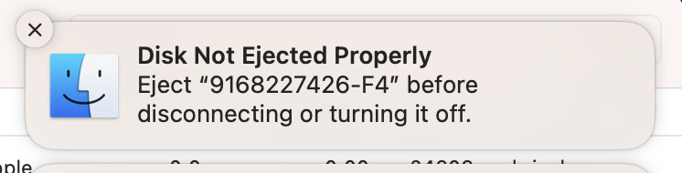

# Unmount Volume After Time Machine

Automatically eject USB disks after Time Machine backup completes.

Launches when a USB disk is inserted and exits after Time Machine completes.

To avoid:



Originally requested as a feature for [nielsmouthaan/ejectify-macos](https://github.com/nielsmouthaan/ejectify-macos/issues/19) but not implemented in that project.

Uses [BrianHenryIE/SwiftTimeMachine](https://github.com/BrianHenryIE/SwiftTimeMachine) and [BrianHenryIE/BHSwiftOSLogStream](https://github.com/BrianHenryIE/BHSwiftOSLogStream) to parse Time Machine logs and query `tmutil` for status. When the backup job completes, the disk is ejected with `DADiskUnmount`.

~~The fundamentals of this are working in this repo~~ The app is working! but it is far from finished.


TODO:
* ~~App should [run when disk plugged](https://apple.stackexchange.com/a/13724/299117) in / Time Machine starts and quit when the disk is ejected~~ [emorydunn/LaunchAgent](https://github.com/emorydunn/LaunchAgent)
* When the app launches upon a disk being inserted, it should exit quickly if the disk is not used for Time Machine
* What happens the app tries to unmount after Time Machine but other files are being copied in Finder?
* Disks should be re-mounted as per the Time Machine schedule
* Some sort of UI/checkbox to enable/disable/communicate the app is present and running [apple/swift-argument-parser](https://github.com/apple/swift-argument-parser)
* [Notifications](https://github.com/dataJAR/Notifier) when the disk is ejected
* ~~Make available via [brew](https://docs.brew.sh/Formula-Cookbook)~~

Quickly install via [yonaskolb/Mint](https://github.com/yonaskolb/Mint) – _A package manager that installs and runs Swift command line tool packages._
```
brew install mint
mint run BrianHenryIE/UnmountVolumeAfterTimeMachine
```


```
mint uninstall BrianHenryIE/UnmountVolumeAfterTimeMachine 
```

